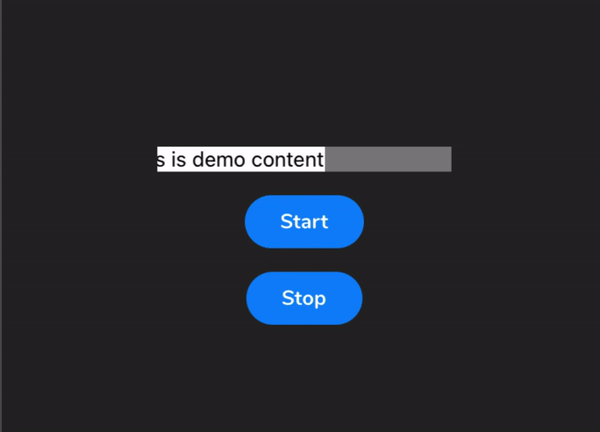

# React Native Marquee View
[](https://badge.fury.io/js/react-native-marquee-view)    
#### Help you auto scroll content

## Demo



## Getting started

```sh
npm install react-native-marquee-view --save
```

- OR


```sh
yarn add react-native-marquee-view
```

## Usage
```javascript
import MarqueeView from 'react-native-marquee-view';

<MarqueeView
	style={{
		backgroundColor: 'blue',
		width: 200,
	}}>
	<View style={{ backgroundColor: 'red' }}>
		<Text>This is demo content</Text>
	</View>
</MarqueeView>

```

## Properties

| Prop                  | Description                                         | Default |
| --------------------- | --------------------------------------------------- | ------- |
| **`style`**           | `View` style                                        | \_      |
| **`speed`**        	| Speed                         | 0.1     |
| **`delay`**           | Delay time before start auto scroll animation (ms). | 0    |
| **`autoPlay`**        | Auto start when it's mount | true    |
| **`playing`**         | You can put state value to this prop to handle play/stop depend on value | \_    |


### Method:
- `start`: Start animation  
- `stop`: Reset animation


### More
This package inspired by https://github.com/homielab/react-native-auto-scroll

## License

This module is [MIT licensed](./LICENSE)

---
  
